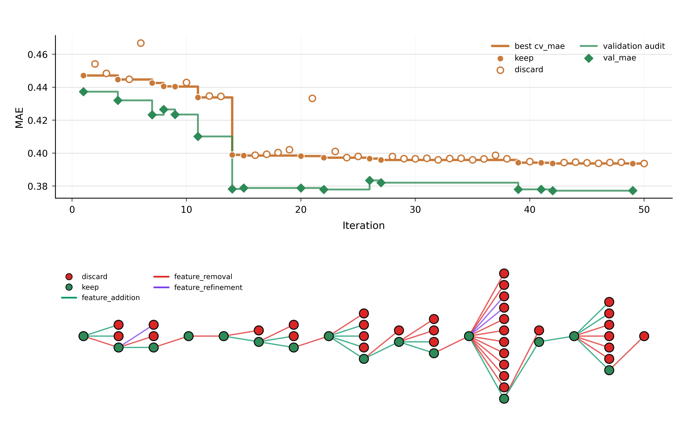

# End-of-Run Report: gap

## Introduction

This run sought composition-only descriptors for predicting the experimental band gap of inorganic materials. The available data comprise 3,223 training compositions and 691 validation compositions, with no missing cells, duplicate compositions, or composition overlap between the two splits. The input is the `composition` column and the target is `gap expt`; `mbid` is present as an identifier but is not a descriptor input. The configured `test.csv` is absent, as expected under the run contract: the final holdout is added only after descriptor search and was not required for this analysis.

Every descriptor was evaluated with a random-forest regressor. Selection used lower-is-better mean absolute error from three-fold training cross-validation. A descriptor was kept only if its `cv_mae` strictly improved the incumbent; validation MAE was then recorded as an audit for keepers but did not alter branch state. The completed run contains 50 experiments: 16 keeps and 34 discards, with no crashes.

## Results

**Overall trajectory.** The 90-feature baseline at `8976216` achieved a CV MAE of 0.447116 and validation MAE of 0.437280. The final selection winner, `lean_element_charge_raw_anion_intensity` at `e76a59d`, reduced CV MAE to 0.393630, an absolute decrease of 0.053486 (12.0%). The best validation audit was 0.377151 for `lean_element_charge_raw_anion_squared_balance` at `949ea7b`, 0.060129 (13.8%) below the baseline validation MAE.

*Figure 1. The upper panel shows per-iteration CV MAE (filled circles for kept experiments and open circles for discards), the running best CV MAE in orange, and validation audits for keepers as green diamonds and a step trace. The lower panel shows the proposal lineage: green and red nodes denote kept and discarded experiments, while green, red, and purple edges denote feature additions, removals, and refinements, respectively.*

The figure shows that improvement was not uniform. A gradual simplification and periodic-identity phase was followed by a large step at the introduction of formula-level charge balance, after which progress consisted mainly of smaller refinements. The broad fan of red lineage nodes in the latter half records informative negative ablations: the strongest late descriptor blocks were difficult to prune without losing CV performance.

**Simplification and elemental identity.** The first useful result was subtraction rather than expansion. `lean_gap_core` (`5831d53`) removed mass and radius statistics from the baseline, reducing the vector from 90 to 72 features while improving CV MAE to 0.444680 and validation MAE to 0.432068. Removing oxidation summaries as well was decisively harmful (`lean_no_oxidation`, `09c19bc`, CV MAE 0.466874), indicating that coarse oxidation priors remained useful even when size-related properties did not. Compact stoichiometric-shape additions also failed to improve the lean core (`df761f0`, 0.444873), suggesting that generic formula moments and ratios were weaker than targeted chemical information.

Periodic-family fractions then produced reproducible, modest gains. Group-and-period histograms reached CV MAE 0.442605 at `73c92ec`; deleting hand-crafted interactions improved CV to 0.440528 at `ef86483`, and retaining only group bins improved it slightly further to 0.440409 at `3eb5f37`. This sequence supports the interpretation that dense group identity was useful, whereas period bins and explicit products were partly redundant with the lean elemental statistics. Exact element-fraction bins were the next major advance: `lean_group_element_fractions` (`d5a59ff`, 184 features) achieved CV MAE 0.433847 and validation MAE 0.410126. Removing group bins or adding period bins both regressed, showing that exact identity and dense periodic-family summaries were complementary rather than interchangeable.

**Charge balance and oxidation assignment.** Formula-level compatibility with common oxidation states caused the largest single improvement. `lean_element_charge_balance` (`38ad1a0`, 194 features) appended a bounded charge-assignment block and reached CV MAE 0.398945 and validation MAE 0.378201. Its proposal hypothesized that neutralizable ionic formulas can be distinguished from unusual or metallic compositions; the magnitude of the observed change is consistent with charge balance providing information not captured by elemental identity alone. Compacting this block to six physical quantities at `fac4422` slightly improved CV MAE to 0.398495, although validation worsened to 0.378768. Removing still more charge information, adding generic assignment statistics, adding hand-crafted charge interactions, or reintroducing mass/radius statistics all failed, with CV MAEs of 0.398778, 0.399355, 0.400363, and 0.402094, respectively.

Element-indexed oxidation assignments provided a smaller but consistent second advance. Weighted oxidation-contribution bins yielded `lean_element_charge_oxidation_bins` (`4904de0`, 284 features; CV 0.398194, validation 0.378828), and adding raw assigned oxidation-state bins produced `lean_element_charge_raw_oxidation_bins` (`d875906`, 378 features; CV 0.397221, validation 0.377937). The ablation that retained the indexed oxidation bins but removed global charge fields regressed sharply to 0.433242 at `ce771eb`. Thus, within this representation, local element-specific valence assignments did not replace the global balance summary; the two encoded complementary structure.

**Late class and anion refinements.** Twelve formula-class and stoichiometry features improved CV to 0.396662 at `89eada8`, but validation rose to 0.383414. Removing the two generic ratio/moment fields gave the 388-feature `lean_element_charge_raw_class_only` (`06d37d0`) and a better CV MAE of 0.395830, yet its validation MAE remained 0.382036. Subsequent one-at-a-time removals of family and cardinality flags, and add-backs of generic stoichiometric summaries, were all discarded. These results support the narrower conclusion that the complete compact class block aided CV selection; they do not establish that it improved validation generalization.

Direct anion-family balance was more successful. Signed oxygen–halogen–heavy-chalcogen contrasts improved CV MAE to 0.394217 at `09c8b64`; adding absolute and then squared contrast magnitudes produced 0.394155 at `c137d08` and 0.393737 at `949ea7b`. The latter also delivered the best validation audit, 0.377151, with 398 features. Individual removals of the squared contrasts all regressed, as did aggregate extrema and total-magnitude additions. Finally, two squared anion-intensity terms produced the formal selection winner `e76a59d` with CV MAE 0.393630 and validation MAE 0.377292 at the 400-feature limit. Its validation result is only 0.000141 worse than that of `949ea7b`, so the evidence does not support treating the extra intensity terms as a meaningful validation improvement.

**CV versus validation.** The audits generally confirm the major scientific gains but do not rank every keeper in the same order as CV. For example, histogram simplifications improved CV while validation fluctuated from 0.423275 to 0.426503 and 0.423417. Likewise, compact charge balance and late class features improved the selection metric while temporarily worsening validation. The final anion refinements restored validation performance, but `keep` therefore cannot be read as “best on validation.” All 50 result rows matched exactly one idea row, every referenced commit and historical `descriptors/idea.md` resolved, all keeper feature counts were measured successfully, and no integrity warnings or errors were found.

## Conclusion

The run supports three main scientific conclusions. First, broad mass and radius summaries were dispensable, whereas oxidation priors, periodic-group fractions, and exact element identity were useful. Second, the strongest gain came from combining formula-level charge neutrality with element-specific oxidation assignments, consistent with band-gap behavior depending on both global ionic plausibility and the identities and valences of the participating elements. Third, compact anion-family contrasts added a small but repeatable improvement near the feature limit; generic stoichiometric expansions, period-bin add-ons, and many plausible interaction terms did not.

The primary validation-supported candidate is `lean_element_charge_raw_anion_squared_balance` at `949ea7b`: validation MAE 0.377151, CV MAE 0.393737, and 398 features. It has the best recorded validation audit and is slightly smaller than the selection winner. 

For a lower-complexity choice, `lean_element_charge_raw_oxidation_bins` at `d875906` offers validation MAE 0.377937 and CV MAE 0.397221 with 378 features, avoiding the late class and anion-balance blocks at very small validation cost. The most compelling parsimonious candidate is `lean_element_charge_balance` at `38ad1a0`, with validation MAE 0.378201, CV MAE 0.398945, and only 194 features. Its validation MAE is just 0.001050 above the best audit while using fewer than half as many features, and its scientific structure is comparatively direct: lean elemental chemistry, group and element identity, and formula-level charge compatibility.