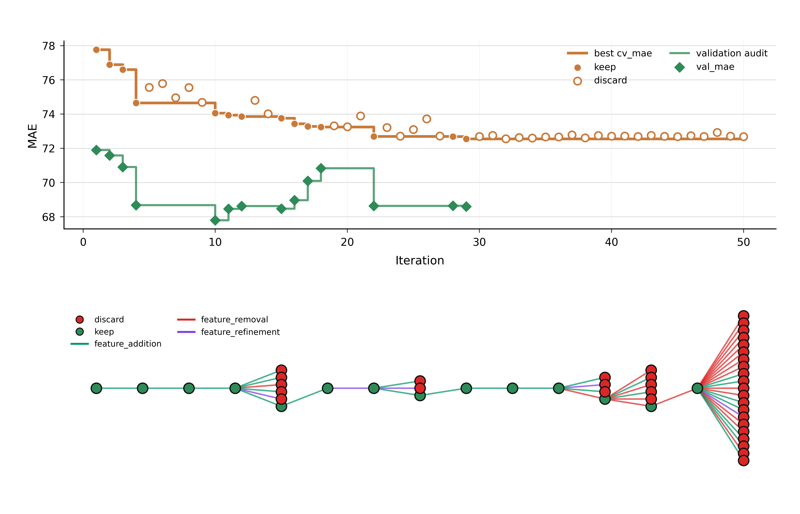

# End-of-Run Report: Tc run-1

## Introduction

This run sought composition-only descriptors for predicting experimental Curie temperature (`Tc`) of inorganic ferromagnetic materials from chemical formula (`Name`). The available data comprised 2,547 training compositions and 546 validation compositions, with no duplicated compositions within either split, no composition overlap between splits, and no missing cells. The training target ranged from 0 to 1,389 (median 237, mean 316.46; interquartile range 55–520), while validation ranged from 0.15 to 1,210 (median 264, mean 322.40; interquartile range 52.75–528). The configured `test.csv` was absent, as expected for a final holdout that is introduced only after descriptor search; its absence is distinct from a missing required run artifact.

All 50 experiments used the a 400-tree random-forest regressor. Selection used lower-is-better mean absolute error from three-fold training cross-validation (`cv_mae`). A proposal was kept only when it strictly improved the incumbent CV MAE. Validation MAE (`val_mae`) was then recorded as an audit for kept descriptors but did not control branch selection. Fourteen descriptors were kept and 36 were discarded; no experiment crashed.

## Results

**Overall trajectory.** The root `baseline` (`354ac4b`) used 61 features spanning stoichiometric complexity, magnetic-element fractions, chemical-family groups, interactions, and elemental-property summaries. It established a CV MAE of 77.763961 and validation MAE of 71.896618. The run then reduced the best CV MAE by 5.212994 to 72.550967, but the validation trajectory reached its minimum substantially earlier.

*Figure 1. The upper panel shows per-iteration CV MAE for kept (filled orange) and discarded (open orange) proposals, the stepwise incumbent CV MAE, and validation audits for kept descriptors as green diamonds and a green step trace. The lower panel shows the proposal lineage, with green kept nodes, red discarded nodes, and edges colored by feature addition (green), feature removal (red), or feature refinement (purple).*

The figure shows rapid gains through the first third of the run, followed by a decisive improvement when pairwise ionicity was removed at iteration 22 and a long plateau after iteration 29. It also makes the CV–validation divergence visible: validation was best at iteration 10, while several later strict CV improvements produced validation errors near 68.5–70.8 rather than a new validation minimum.

**Chemistry and identity features produced the largest early gains.** Magnetic-sublattice ratios and explicit magnet-family channels improved the baseline incrementally. Adding common oxidation-state and charge-balance proxies in `valence_balance_v1` (`15ed10a`) was the first large advance, reaching 74.649467 CV MAE and 68.677418 validation MAE with 155 features. In contrast, approximate shell occupancy, broad thermo-mechanical elemental priors, a reduced family representation, generic stoichiometric patterns, and removal of the unbounded valence ratio all regressed in CV. The committed rationales suggest a plausible interpretation: family identity and oxidation-state capacity preserve task-relevant distinctions between metallic and anion-rich magnetic chemistries, whereas coarse shell or bulk-property proxies are too indirect and generic stoichiometric summaries do not identify exchange mechanisms reliably from formula alone.

The systematic elemental fingerprint in `periodic_identity_v1` (`bc18258`) then improved CV MAE to 74.056525 and achieved the run's best validation MAE, 67.789463, using 261 features. This supports the proposal's premise that a complete bounded atomic-number fraction map can recognize substitutions and less common composition families that a hand-selected element list misses. Importantly, this descriptor is the validation leader even though it is not the CV-selection winner.

**Pair chemistry helped CV, but complexity and validation favored restraint.** Targeted magnetic–environment co-occurrences improved CV further. The full `sublattice_pair_v1` used 386 features and scored 73.935738 CV MAE and 68.457732 validation MAE. Its slim refinement removed 77 features and slightly improved CV to 73.853212, although validation weakened to 68.623636; this was a useful simplification under the selection contract, but not a validation gain. A compact bounded valence transformation yielded `bounded_valence_pair_v1` (`0f3683a`; 319 features), with 73.759327 CV MAE and 68.472335 validation MAE. Conversely, adding reduced stoichiometry or a systematic Fe+Co-by-element pair map was unsuccessful, consistent with the earlier evidence that broad interaction maps and formula-pattern blocks added sparse or redundant splits.

Electronegativity contrasts improved CV to 73.435637 in `electronegativity_pair_v1`, but the subsequent pairwise ionicity and magnetic-exchange blocks exposed the strongest disagreement between selection and audit: `ionicity_pair_v1` and `magnetic_exchange_balance_v1` improved CV to 73.277043 and 73.240382 while validation worsened to 70.098014 and 70.832722. This does not invalidate their kept status, because the run contract selected only on CV. It does indicate that the increasingly detailed pairwise contrast representation did not generalize to the fixed validation split. A plausible interpretation is that the random forest exploited composition-family partitions specific to the training folds, while the broader periodic identity and valence representation transferred more robustly.

**Removing pairwise ionicity and pruning redundant raw channels defined the final CV branch.** `exchange_no_ionicity_v1` (`971e53d`) retained electronegativity summaries and exchange-density/dilution features but removed the pairwise ionicity block. This produced a substantial CV improvement to 72.687121 and restored validation MAE to 68.635648 with 366 features. Removing the broader electronegativity block, eliminating all raw exchange fractions, adding rare-earth refinements, or encoding permanent-magnet archetype distances did not improve CV, implying that electronegativity context and selected raw network totals remained useful even after pairwise ionicity was removed.

Focused pruning was then productive but quickly saturated. Removing raw Mn+Cr and Ni channels gave `exchange_prune_competitors_v1` (`ee88d22`; 364 features), at 72.686762 CV MAE and 68.642440 validation MAE. Removing the separate raw Fe and Co channels while retaining Fe+Co total and normalized balances produced the selection winner, `exchange_prune_fe_co_raw_v1` (`56eecc7`; 362 features), at 72.550967 CV MAE and 68.598476 validation MAE. The proposal rationale is supported by the ablations: reintroducing raw Fe, Co, Mn+Cr, or Ni failed, whereas removing Fe+Co total, metal totals, magnetic-3d content, environmental fractions, or balance terms also failed. Thus the successful simplification was selective rather than wholesale: redundant individual-element aggregate channels could be removed, but the total exchange density, environmental context, and normalized balances remained jointly useful. None of the final 21 proposals strictly improved the winner; the closest, `exchange_prune_raw_anions_v1` (`38749d7`), reached 72.560587 CV MAE but was correctly discarded.

**Run integrity.** The evidence collector found no errors or warnings: all 50 result rows had matching idea rows, all referenced commits and historical proposal documents resolved, descriptor identities matched, and feature counts were measurable for every validation-tested keeper. The absent test split is consistent with the stated experimental contract and was not used. 

## Conclusion

The run shows that chemically explicit composition identity, oxidation-state capacity, and compact exchange-network context are the most useful formula-only signals for this dataset. Broad shell, thermo-mechanical, stoichiometric-archetype, and dense pairwise-interaction additions were generally unproductive. The strongest later result came from simplifying an exchange descriptor: pairwise ionicity and a few redundant raw element channels were removed, while Fe+Co total, magnetic-network normalization, electronegativity context, and dilution features were retained. Nevertheless, continued CV improvement did not imply continued validation improvement, so the validation audits should be treated as comparative evidence rather than as another tuning loop.

The leading candidate for validation-oriented use is `periodic_identity_v1` at commit `bc18258`: it has the lowest recorded validation MAE (67.789463), a CV MAE of 74.056525, and 261 features. Its systematic elemental fingerprint offers the best observed audit performance at moderate complexity. The required selection-metric winner is `exchange_prune_fe_co_raw_v1` at commit `56eecc7`: it has the lowest CV MAE (72.550967), validation MAE 68.598476, and 362 features. It is scientifically credible because targeted pruning improved both CV and complexity while retaining physically interpretable exchange-density and dilution signals, although its validation MAE is 0.809013 above the validation leader. For a substantially smaller alternative, `valence_balance_v1` at commit `15ed10a` has validation MAE 68.677418, CV MAE 74.649467, and only 155 features; it sacrifices 0.887955 validation-MAE units relative to the best audit result while removing 106 features and retaining a clear oxidation-state and bonding interpretation.

These three descriptors define the defensible tradeoff: `periodic_identity_v1` for the strongest validation evidence, `exchange_prune_fe_co_raw_v1` for fidelity to the predeclared CV selection rule, and `valence_balance_v1` for compact scientific structure. 
